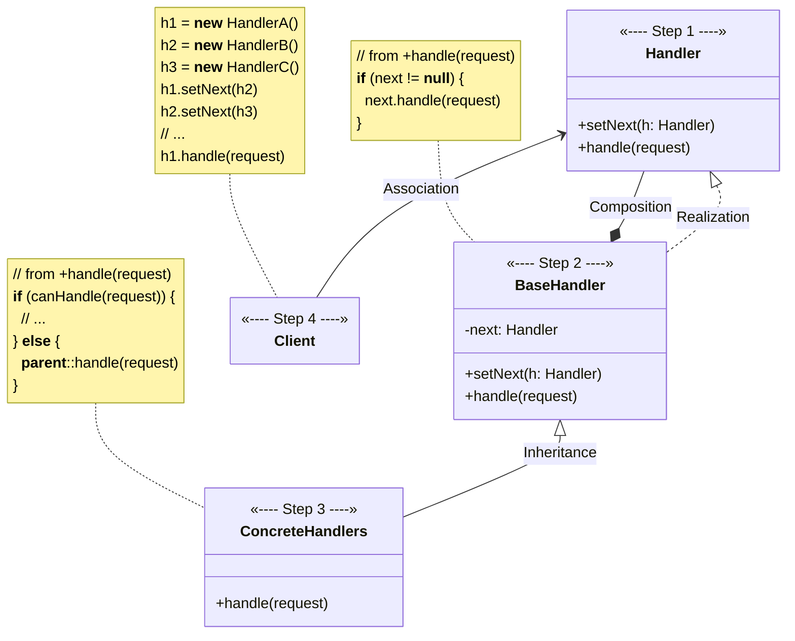
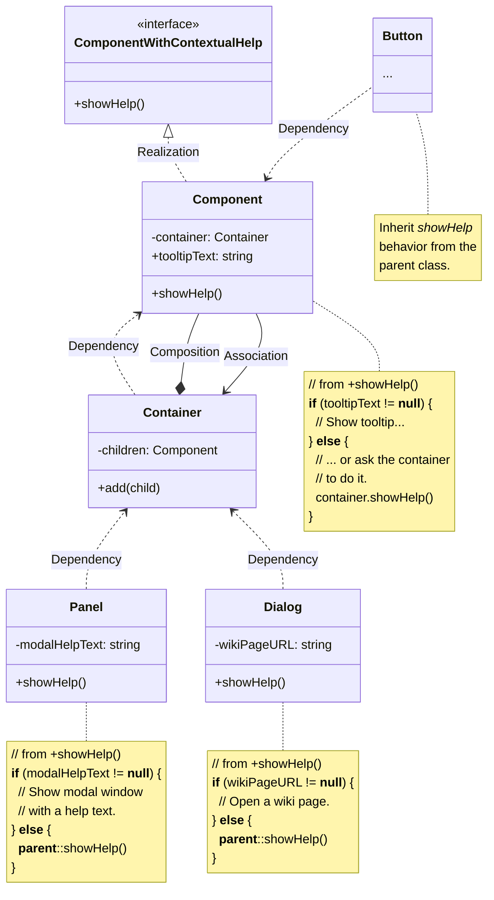

# Chain of Responsibility

[_Refactoring Guru: Chain of Responsibility_](https://refactoring.guru/design-patterns/chain-of-responsibility)

_Also known as: **TBD**_

- a behavioral design pattern
- allows passing requests along a chain of handlers
- upon receiving a request, each handler decides either to process request or pass it to next handler in the chain

## The Pattern

- relies on transforming particular behaviors into stand-alone objects called _**handlers**_
- suggests linking these _**handlers**_ into a chain
- each linked _**handler**_
    - has a field for storing a reference to next handler in the chain
    - potentially processes the request
    - can pass request further along the chain or decide not to pass it along, effectively stopping any further processing
- a request travels along chain until all _**handlers**_ have had a chance to process it
- slightly more canonical approach that's common when dealing with events in stacks of elements in GUI:
    - upon receiving request, _**handler**_ decides whether it can process it
    - if it can, it doesn't pass the request any futher
    - so it's either one _**handler**_ that processes request or none at all

## Structure

1. **Handler** declares common interface for all handlers
    - usually contains single method for handling requests
    - sometimes may also have another method for setting next _**Handler**_ on the chain
2. **Base Handler** is optional class where you can put boilerplate code that's common to all _**Handler**_ classes
    - usually defines a field for storing reference to next **Handler**
    - clients can build chain by passing _**Handler**_ to constructor or setter of previous _**Handler**_
    - class may also implement default handling behavior: it can pass execution to next handler after checking for its existence
3. **Concrete Handlers** contain actual code for processing requests: upon receiving request, each handler must decide whether to process it and whether to pass it along the chain
    - **Handlers** are usually self-contained and immutable, accepting all necessary data just once via constructor
4. **Client** may compose chains just once or compose them dynamically

## Pseudocode

<figure>

<figcaption>

The GUI classes are built with the Composite pattern. Each element is linked to its container element. At any point, you can build a chain of elements that starts with the element itself and goes through all of its container elements.

</figcaption>

</figure>
