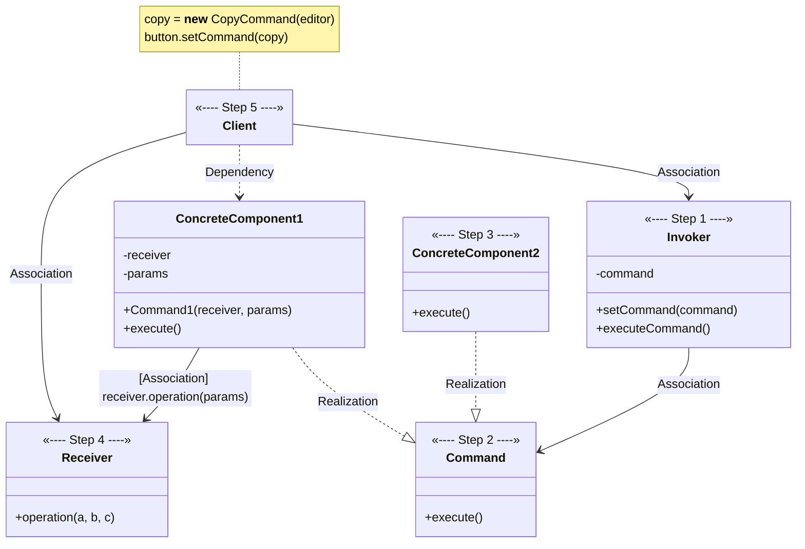
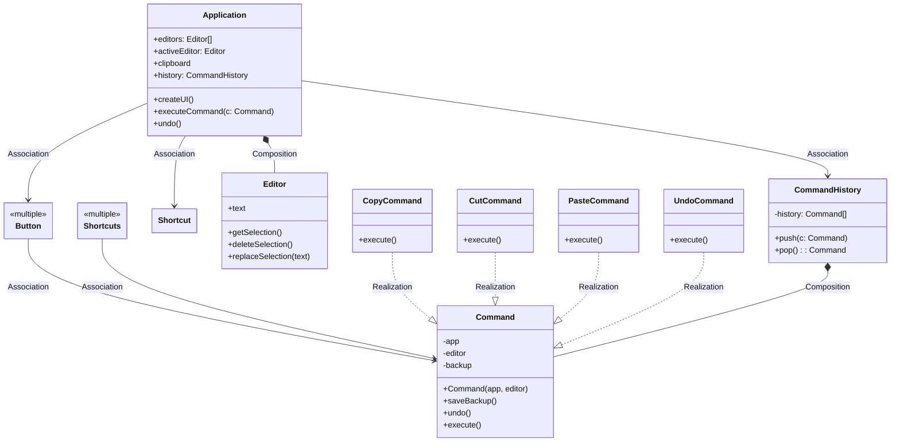

# Command

[_Refactoring Guru: Command_](https://refactoring.guru/design-patterns/command)

_Also known as: **Action**, **Transaction**_

- a behavioral design pattern
- turns request into stand-alone object that contains all information about request
- this transformation lets you...
    - pass requests as method arguments
    - delay or queue a request's execution
    - support undoable operations

## The Pattern

- suggests that all request details _(such as object being called, name of method, and list of arguments)_ should be extracted into a separate **Command** class with a single method that triggers request
- **Commands** should implement the same interface, which usually has just single execution method that takes no parameters
    - lets you use various **Commands** with same request sender without coupling it to concrete classes of **Commands**
    - as bonus, you can also switch **Command** objects linked to the sender, effectively changing the sender's behvior at runtime
- **Command** should either be pre-configured with data or capable of getting it on its own

## Structure

1. **Sender** class _(aka **invoker**)_ is responsible for initiating requests
   - must have field for storing reference to **Command** object
   - triggers **Command** instead of sending request directly to **Receiver**
   - isn't responsible for creating **Command** object
   - usually gets pre-created **Command** from **Client** via constructor
2. **Command** interface usually declares just a single method for executing command
3. **Concrete Commands** implement various kinds of requests
    - isn't supposed to perform work on its own
    - should pass call to one of business logic objects
    - parameters required to execute method on receiving object can be declared as fields in **Concrete Command**
    - can make **Command** objects immutable by only allowing initialization of these fields via constructor
4. **Receiver** class contains some business logic
    - almost any object may act as **Receiver**
    - most **Commands** only handle details of how request is passed to **Receiver**, while **Receiver** itself does actual work
5. **Client** creates and configures **Concrete Command** objects
    - must pass all of request parameters, including **Receiver** instance, to **Command**'s constructor
    - resulting **Command** may be associated with one or multiple senders

## Pseudocode

<figure>

<figcaption>

**Command** pattern helps to track history of executed operations and makes it possible to revert an operation if needed.

</figcaption>

</figure>
