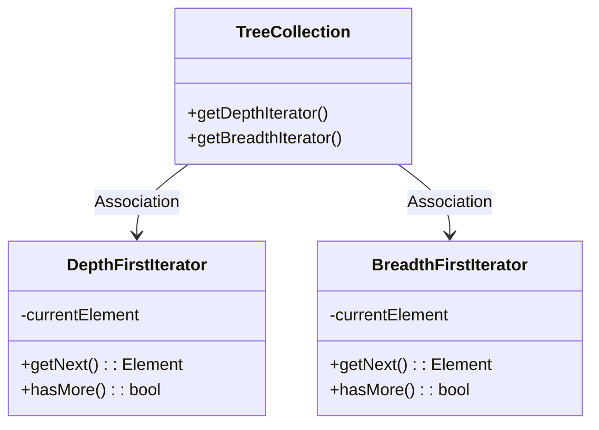
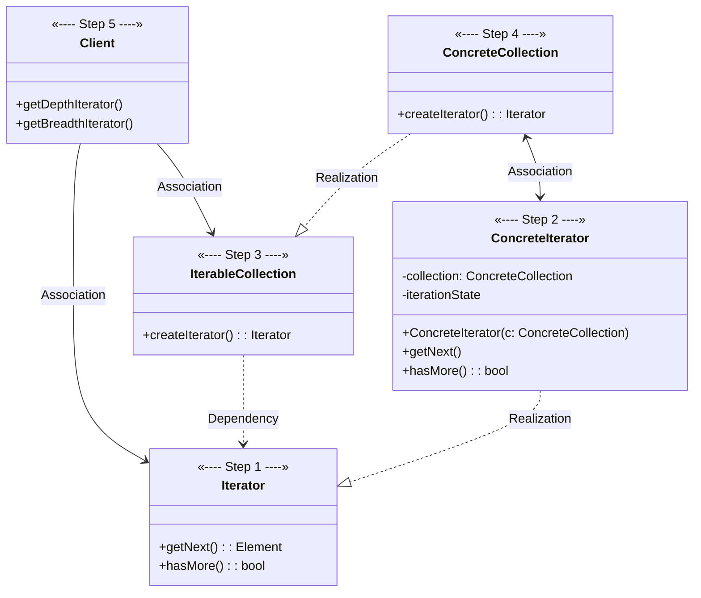
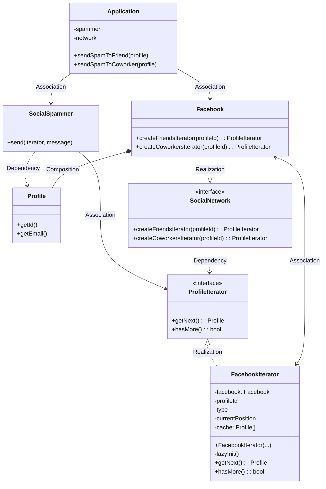

# Iterator

[_Refactoring Guru: Iterator_](https://refactoring.guru/design-patterns/iterator)

_Also known as: **TBD**_

- a behavioral design pattern
- lets you traverse elements of collection without exposing underlying representation _(list, stack, tree, etc.)_

## The Pattern

- main idea: extract traversal behavior of collection into a separate object called an **Iterator**

## Structure

1. **Iterator** interface declares operations required for traversing collection:
    - fetching next element
    - retrieving current position
    - restarting iteration
    - etc.
2. **Concrete Iterators** implement specific algorithms for traversing collection
    - should track traversal progress on its own, which allows several iterators to traverse same collection independently of each other
3. **Collection** interface declares one or multiple methods for getting iterators compatible with collection
    - _**NOTE**: return type of methods must be declared as **Iterator** interface so that **Concrete Collections** can return various kinds of iterators_
4. **Concrete Collection** returns new instances of particular **Concrete Iterator** class each time client requests one
5. **Client** works with both **Collections** and **Iterators** via their interfaces, thereby decoupling it from concrete classes
    - don't typically create **Iterators** on their own, instead getting them from **Collections**

## Pseudocode

<figure>

<figcaption>

**Iterator** pattern is used to walk through a special kind of **Collection** which encapsulates access to Facebook's social graph. The **Collection** provides several **Iterators** that can traverse profiles in various ways.

</figcaption>

</figure>
