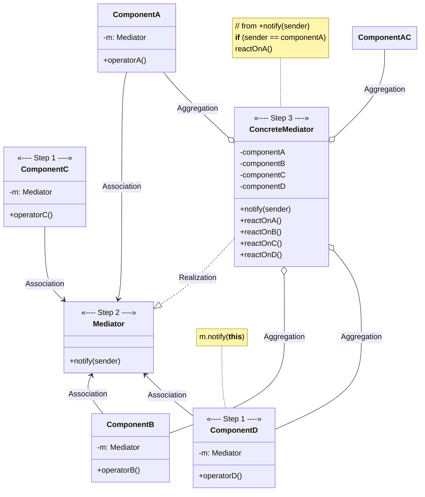
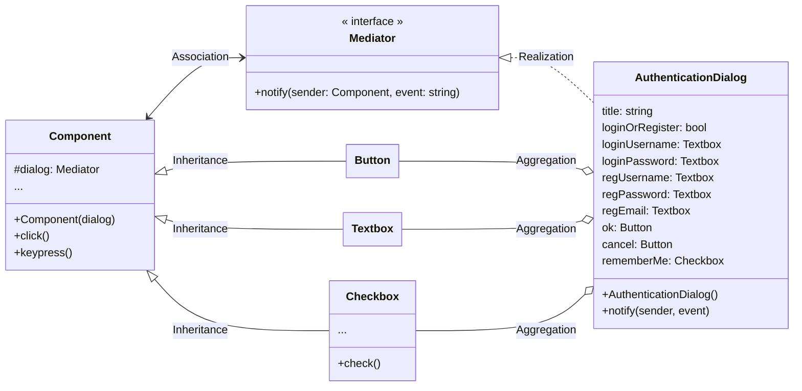

# Mediator

[_Refactoring Guru: Mediator_](https://refactoring.guru/design-patterns/mediator)

- a behavioral design pattern
- helps reduce chaotic dependencies between objects by restricting direct communications between objects and forcing them to collaborate only via a **Mediator** object

## The Pattern

- suggests that you should cease all direct communication between components which you want to make independent of each other
- instead, components must collaborate indirectly by calling a special **Mediator** object that redirects the calls to appropriate components
- the result: components depend only on single **Mediator** class instead of being coupled to dozens of their colleagues

## Structure

1. **Components**
   - are various classes that contain some business logic
   - each component contains a reference to a **Mediator** _(declared with the **Mediator** interface)_
   - not aware of actual class of the **Mediator** _(means component can be reused by other programs by linking it to a different **Mediator**)_
2. **Mediator** inteface
   - declares methods of communication with components _(usually include just a single notification method)_
   - components may pass any context as arguments to this method _(including own objects)_ but _**only in such a way that no coupling occurs between receiving component and sender's class
3. **Concrete Mediators**
   - encapsulate relations between various components
   - often keep references to all components they manage _(and sometimes manage their lifecycle)_
4. _**Components must not be aware of other components.**_ If something important happens within or to a component, it must only notify the **Mediator**. When the **Mediator** receives the notification, it can easily identify the sender

## Pseudocode

<figure>

<figcaption>

Structure of the UI dialog classes.

</figcaption>

</figure>
