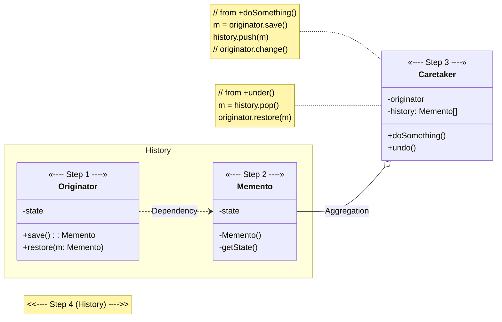
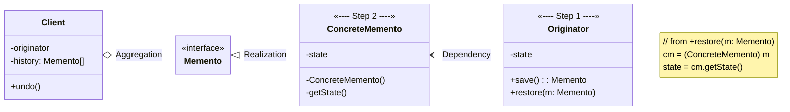
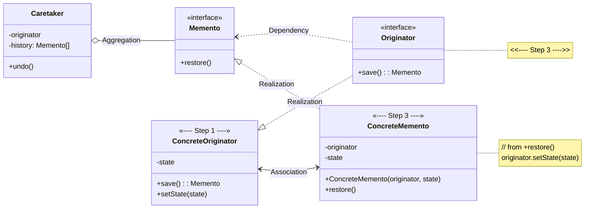
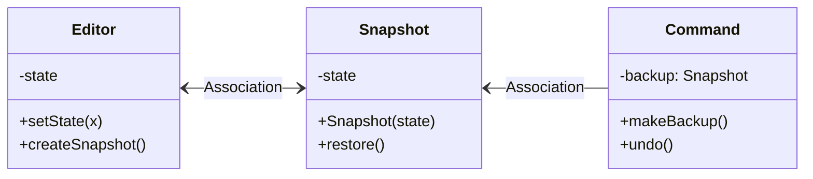

# Memento

[_Refactoring Guru: Memento_](https://refactoring.guru/design-patterns/memento)

## The Pattern

- a behavioral design pattern
- allows for saving and restoring previous state of an object without revealing details of its implementation

## Structure

### Implementation based on nested classes

1. **Originator** class produces snapshots of its own state, as well as restore its state from snapshots
2. **Memento** is value object that acts as a snapshot of **Originator**'s state. Common practice is to make **Memento** immutable and pass it data only once via constructor.
3. **Caretaker** knows when and why to capture **Originator**'s state, as well as when state should be restored.
   - can keep track of **Originator**'s history by storing stack of **Mementos**
   - when **Originator** has to travel back in history, **Caretaker** fetches topmost **Memento** from stack and passes it to **Originator**'s restoration method
4. In this implementation, **Memento** class is nested inside **Originator**, which lets **Originator** access fields and methods of **Memento**, even though they're declared private. On the other hand, **Caretaker** has very limited access to **Memento**'s fields and methods, which lets it store **Mementos** in a stack without tampering with their state.

### Implementation based on intermediate interface

1. In absence of nested classes, can restrict access to **Memento**'s fields by establishing a convention that **Caretakers** can work with a **Memento** _**only**_ through explicitly declared intermediary interface _(which would only declare methods related to **Memento**'s metadata)_
2. On the other hand, **Originators** can work with **Memento** object directly, accessing fields and methods declared in **Memento** class. The downside is that all members of **Memento** must be publicly declared.

### Implementation with even stricter encapsulation

1. This implementation allows having multiple types of **Originators** and **Mementos**. Each **Originator** works with corresponding **Memento** class. Neither **Originators** nor **Mementos** expose their state to anyone.
2. **Caretakers** now explicitly restricted from changing state stored in **Mementos**. **Caretaker** class becomes independent from **Originator** because restoration method is now defined in **Memento** class.
3. Each **Memento** becomes linked to **Originator** that produced it. **Originator** passes itself to **Memento**'s constructor, along with values of its state. Thanks to close relationship between these classes, **Memento** can restore the state of its **Originator**, given that the latter has defined the appropriate setters.

## Pseudocode

<figure>

<figcaption>

Saving snapshots of the text editor's state.

</figcaption>

</figure>
