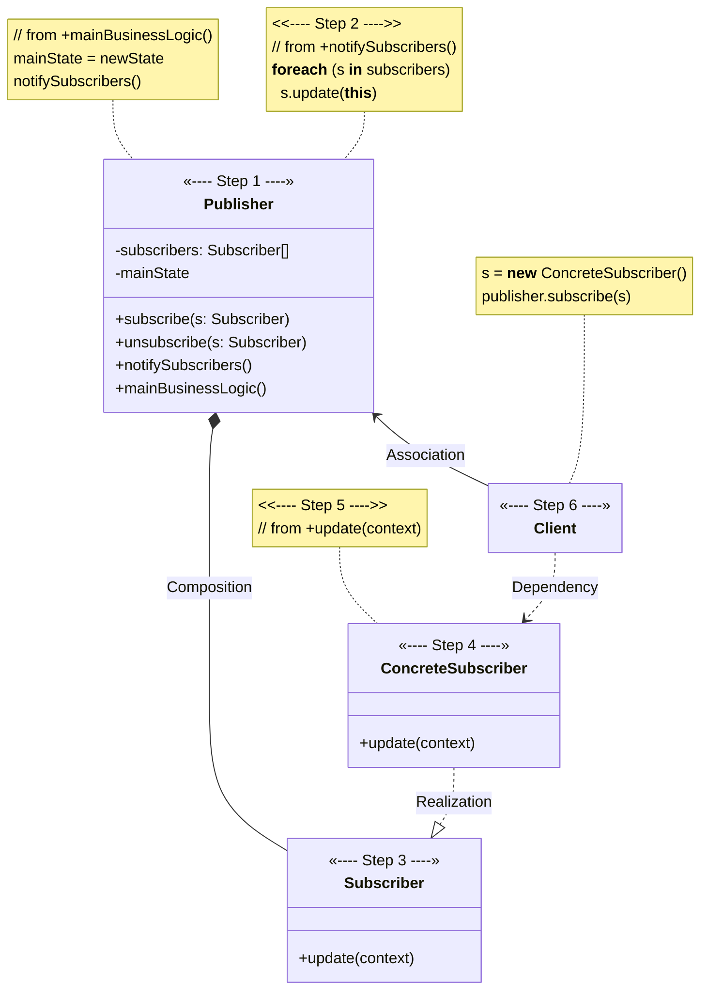
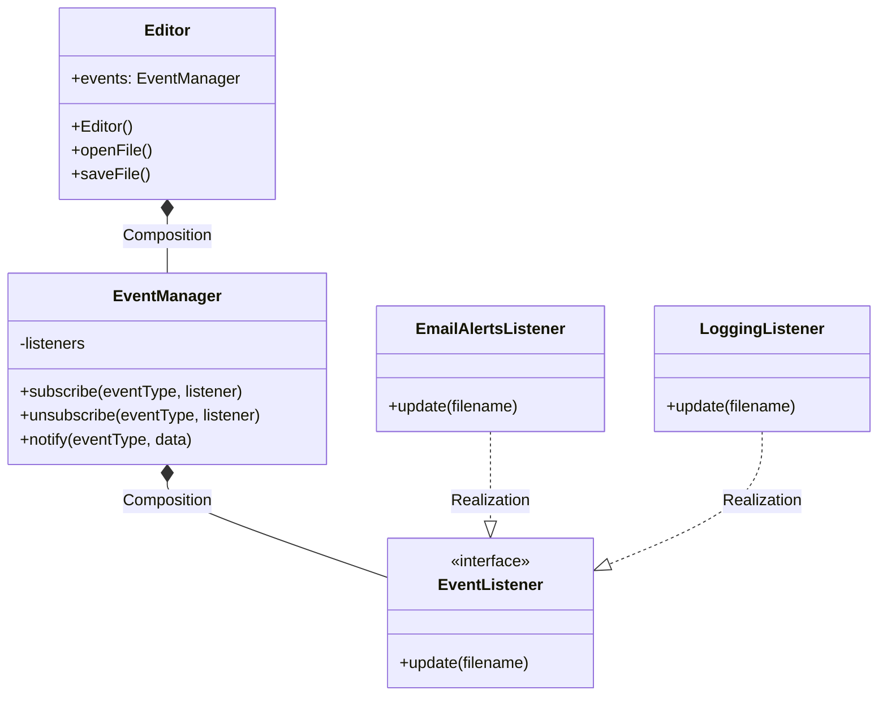

# Observer

[_Refactoring Guru: Observer_](https://refactoring.guru/design-patterns/observer)

_Also known as: **Event-Subscriber**, **Listener**_

- a behavioral design pattern
- lets you define a subscription mechanism to notify multiple objects about any events that happen to the object they're observing

## The Pattern

- the object that has interesting state is often called _**subject**_, and since it's also going to notify other objects about changes to its state, we'll call it _**publisher**_
- all other objects that want to track changes to the _**publisher's**_ state are called _**subscribers**_
- **Observer** pattern suggests that you add a subscription mechanism to the _**publisher**_ class so individual objects can _subscribe_ to or _unsubscribe_ from a stream of events coming from that _**publisher**_
- mechanism basically consists of:
    1. array field for storing list of references to _**subscriber**_ objects
    2. several public methods which allow adding _**subscribers**_ to and removing them from that list

## Structure

1. **Publisher** issues events of interest to other objects
    - these events occur when the **Publisher** changes its state or executes some behaviors
    - contain a subscription infrastructure that lets new **Subscribers** join and current **Subscribers** leave the list
2. when a new event happens, the **Publisher** goes over the subscription list and calls the notification method declared in the **Subscriber** interface on each **Subscriber** object
3. **Subscriber** interface declares the notification interface
    - usually consists of single `update` method, which may have several parameters that let the **Publisher** pass some event details along with the update
4. **Concrete Subscribers** performs some actions in response to notifications issued by **Publisher**
    - all of these classes must implement same interface so **Publisher** isn't coupled to concrete classes
5. usually, **Subscribers** need some contextual information to handle the update correctly
    - for this reason, **Publishers** often pass some context data as arguments of the notification method
    - **Publisher** can pass itself as an argument, letting **Subscriber** fetch any required data directly
6. **Client** creates **Publisher** and **Subscriber** objects separately and then registers **Subscribers** for **Publisher** updates

## Pseudocode

<figure>

<figcaption>

**Observer** pattern lets the text editor object notify other service objects about changes in its state.

</figcaption>

</figure>
