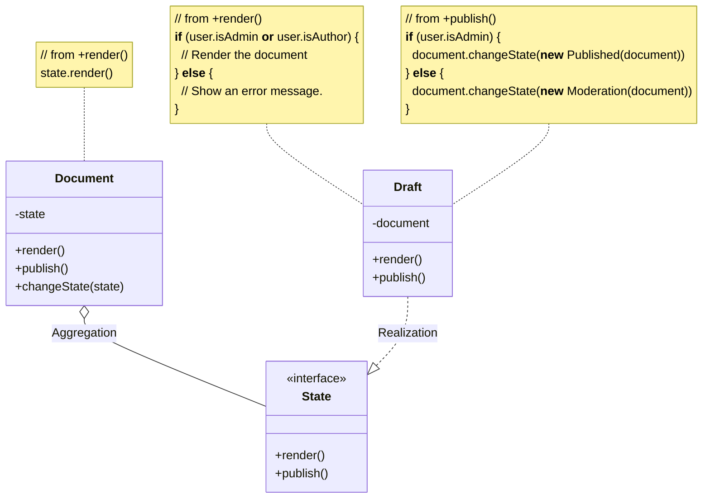
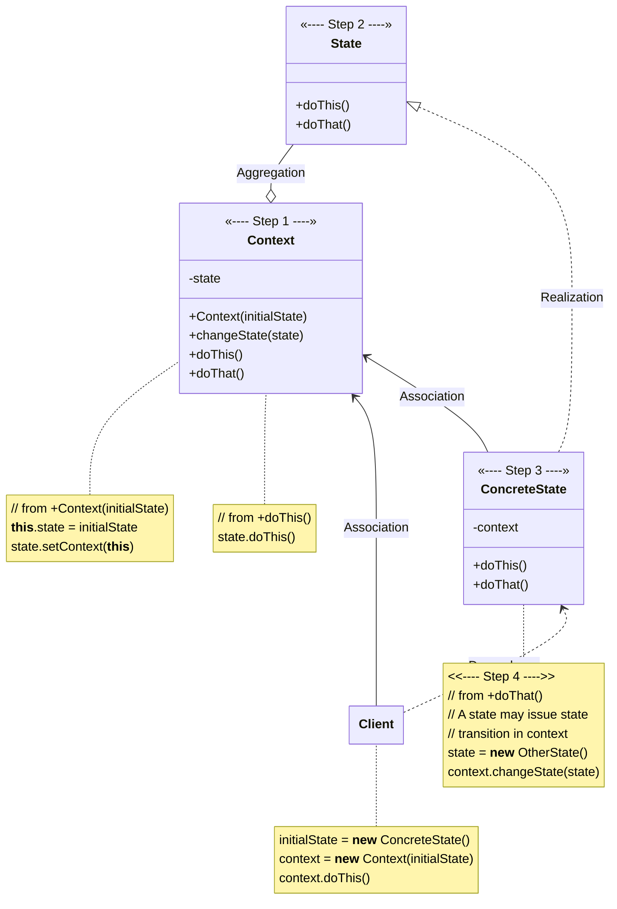
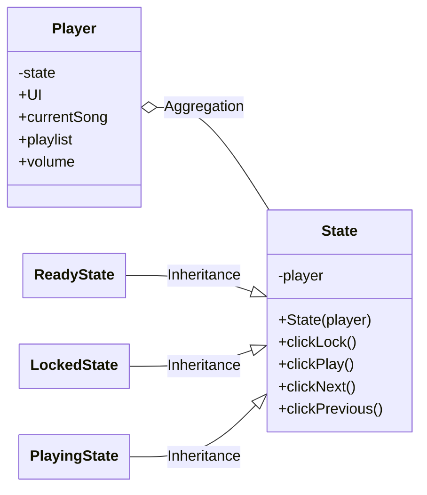

# State

[_Refactoring Guru: State_](https://refactoring.guru/design-patterns/state)

_Also known as: **TBD**_

- a behavioral design pattern
- lets an object alter its behavior when its internal state changes _(appears as if object changed its class)_

## The Pattern

- closely related to concept of a _[Finite-State Machine](https://en.wikipedia.org/wiki/Finite-state_machine)_
- main idea:
    - at any given moment, there's a _finite_ number of _states_ which a program can be in
    - within any unique state, program behaves differently
    - program can be switched from one state to another instantaneously
    - however depending on current state, program may or may not switch to certain other states
    - these switching rules, called _transitions_, are also finite and predetermined
- can also apply this approach to objects
    - imagine a `Document` class
    - `Document` can be in one of three states: `Draft`, `Moderation`, or `Published`
    - the `publish` method of `Document` works differently in each state:
        - in `Draft`, moves `Document` to `Moderation`
        - in `Moderation`, makes `Document` public but only if the current user is an administrator
        - in `Published`, doesn't do anything at all

> **NOTE**: one key difference from **Strategy** pattern: in **State** pattern, the particular **States** may be aware of each other and initiate _transitions_ from one **State** to another _(whereas **Strategies** almost never know about each other)_

## Structure

1. **Context** stores reference to one of the **ConcreteState** objects and delegates all state-specific work to it. It also:
    - communicates with **State** object via **State** interface
    - exposes setter for passing it to new **State** object
2. **State** interface declares **State**-specific methods, which should make sense for _**all**_ **ConcreteStates** because you don't want some **States** to have useless methods that never get called.
3. **ConcreteStates** provide own implementation for the **State**-specific methods. To avoid duplication of similar code across multiple **States**, you may provide intermediate abstract classes that encapsulate some common behavior.
    - **State** objects may store backreference to **Context** object, through which the **State** can fetch any required info from **Context** as well as initiate **State** _transitions_.
4. Both **Context** and **ConcreteStates** can set next **State** of **Context** and perform actual **State** _transition_ by replacing **State** object linked to the **Context**.

## Pseudocode

<figure>

<figcaption>

**State** pattern lets same controls of the media player behave differently, depending on the current playback **State**.

</figcaption>

</figure>
