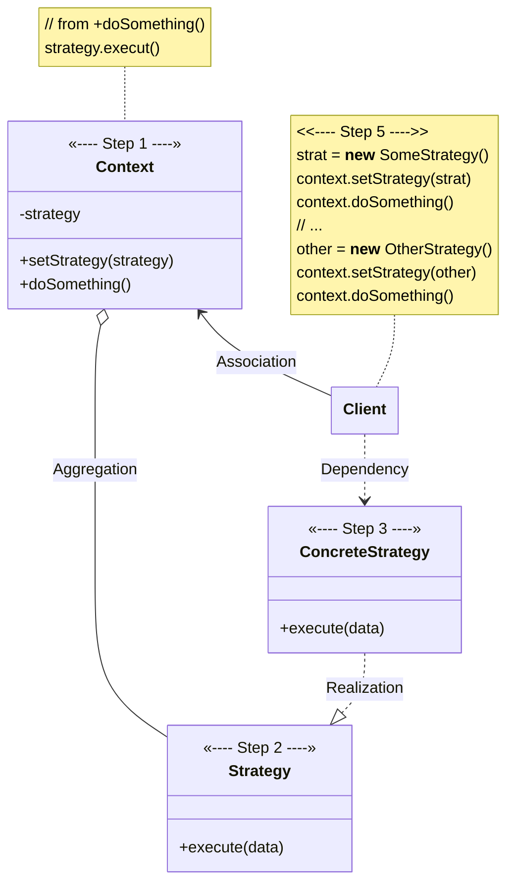

# Strategy

[_Refactoring Guru: Strategy_](https://refactoring.guru/design-patterns/strategy)

_Also known as: **TBD**_

- a behavioral design pattern
- allows defining family of algorithms, putting each of them into separate classes, and making their objects interchangeable

## The Pattern

- suggests that you take a class that does something specific in many different ways and extract all of those algorithms into separate classes called **Strategies**
- original class, called **Context**, must have field for storing reference to one of the **Strategies**
- the **Context** class...
    - delegates work to linked **Strategy** object instead of executing it on its own
    - isn't responsible for selecting appropriate algorithm for a job: instead, client passes desired strategy to **Context**
    - works with all **Strategies** through same generic interface, which only exposes single method for triggering algorithm encapsulated within selected **Strategy**
    - is kept independent of concrete **Strategies** so new **Strategies** can be added or existing ones can be modified without changing code of **Context** or other **Strategies**

## Structure

1. **Context** maintains reference to one of the _concrete **Strategies**_ and communicates with this object only via the _**Strategy** interface_
2. _**Strategy** interface_ is common to all _concrete **Strategies**_ and it declares a method used by **Context** to execute a **Strategy**
3. **Concrete Strategies** implement different variations of an algorithm used by context
4. **Context** calls execution method on linked **Strategy** object each time it needs to run algorithm. **Context** doesn't know what type of **Strategy** it works with or how algorithm is executed
5. **Client** creates specific **Strategy** object and passes it to **Context**. **Context** exposes setter which lets clients replace **strategy** associated with **Context** at runtime.

## Pseudocode

**Context** uses multiple **Strategies** to execute various arithmetic operations.

_see [ExampleApplication](./example_application.py)_
