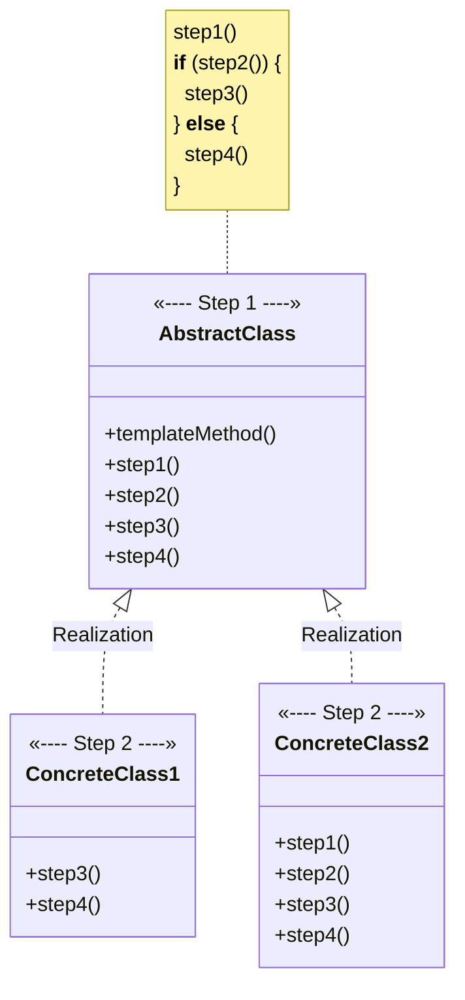
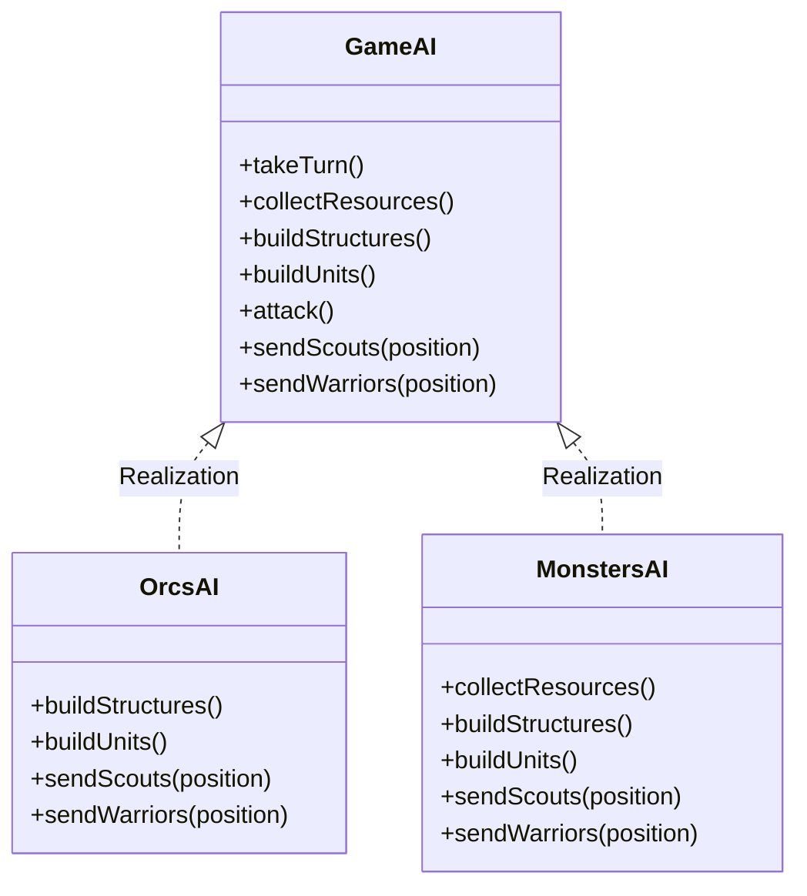

# Template Method

[_Refactoring Guru: Template Method_](https://refactoring.guru/design-patterns/template-method)

_Also known as: **TBD**_

- a behavioral design pattern
- defines skeleton of an algorithm in the superclass but lets subclasses override specific steps of algorithm without changing its structure

## The Pattern

- suggests:
    1. breaking down algorithm into series of steps
    2. turn these steps into methods
    3. put series of calls to these methods inside a single **Template Method**
- steps may be either `abstract` or have some default implementation
- to use algorithm, client is supposed to provide its own subclass, implement all abstract steps, and override some of the optional ones if needed _(but note the **Template Method** itself)_

## Structure

1. **AbstractClass** declares methods that act as steps of an algorithm, as well as the actual template method which calls these methods in a specific order. The steps ay either be declared `abstract` or have some default implementation.
2. **ConcreteClasses** can override all of the steps but not the template method itself.

## Pseudocode

<figure>

<figcaption>

**TemplateMethod** pattern provides a "skeleton" for various branches of artificial intelligence in a simple strategy video game.

</figcaption>

</figure>
