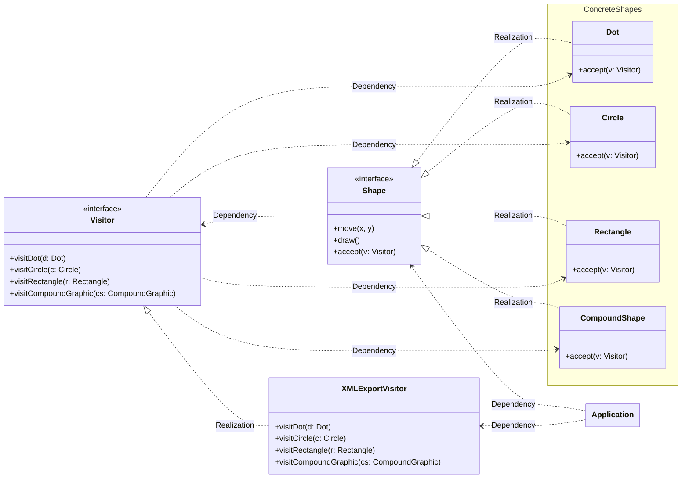

# Visitor

[_Refactoring Guru: Visitor_](https://refactoring.guru/design-patterns/visitor)

_Also known as: **TBD**_

- a behavioral design pattern
- allows separating algorithms from object on which they operate

## The Pattern

- suggests you place new behavior into separate class called **Visitor**, instead of trying to integrate it into existing classes
- original object that had to perform the behavior is now passed to one of the **Visitor**'s methods as an argument, providing the method access to all necessary data contained within the object
- uses technique called [**Double Dispatch**](https://refactoring.guru/design-patterns/visitor-double-dispatch) which helps to execute proper method on an object without cumbersome conditionals
    - instead of letting client select a proper version of method to call, the choice is delegated to objects being passed to **Visitor** as an argument

    ```python
    # Example Visitor
    class ExportVisitor(Visitor):
        def do_for_city(self, city: City): ...
        def do_for_industry(self, industry: Industry): ...
        def do_for_sight_seeing(self, sight_seeing: SightSeeing): ...

    # client code
    for node in graph:
        node.accept(exportVisitor)

    # City
    class City:
        def accept(self, visitor: Visitor):
            visitor.do_for_city(self)

    # Industry
    class Industry:
        def accept(self, visitor: Visitor):
            visitor.do_for_industry(self)
    ```

## Structure

```mermaid
---
config:
    class:
        hideEmptyMembersBox: true
---
classDiagram

    Visitor --> ClassB : Association
    Visitor <.. Element : Dependency
    ConcreteVisitor ..|> Visitor : Realization
    Visitor ..> ConcreteElementA : Dependency
    Visitor ..> ConcreteElementB : Dependency
    ConcreteElementA ..|> Element : Realization
    ConcreteElementB ..|> Element : Realization
    ConcreteVisitor <.. Client : Dependency
    Element <.. Client : Dependency

    class Visitor {
        <<---- Step 1 ---->>
        <<interface>>
        +visit(e: ElementA)
        +visit(e: ElementB)
    }

    class Element {
        <<---- Step 3 ---->>
        <<interface>>
        +accept(v: Visitor)
    }

    note for ConcreteVisitor "// from +visit(e: ElementB)
    // Visitor methods know the
    // concrete type of the
    // element it works with.
    e.featureB()"
    class ConcreteVisitor {
        <<---- Step 2 ---->>
        <<multiple>>
        +visit(e: ElementA)
        +visit(e: ElementB)
    }

    class ConcreteElementA {
        <<---- Step 4 ---->>
        +featureA()
        +accept(v: Visitor)
    }

    note for ConcreteElementB "// from +accept(v: Visitor)
    v.visit(**this**)"
    class ConcreteElementB {
        <<---- Step 4 ---->>
        +featureB()
        +accept(v: Visitor)
    }

    note for Client ""element.accept(**new** ConcreteVisitor())
    class Client {}
```

1. **Visitor** interface declares a set of visiting methods that can take conrecte elements of an object structure as agruments. These methods may have same names if program is written in a language that supports overloading, but type of their parameters must be different.
2. Each **ConcreteVisitor** implements several versions of the same behaviors, tailored for different concrete element classes.
3. **Element** interface declares a method for "accepting" visitors. This method should have one parameter declared with the type of the **Visitor** interface.
4. Each **ConcreteElement** must implement the acceptance method. The purpose of this method is to redirect the call to the proper visitor's method corresponding to the current element class. Be aware that even if a base element class implements this method, _**all**_ subclasses must still override this method in their own classes and call the appropriate method on the **Visitor** object.
5. **Client** usually represents a collection or some other complex object _(for example, a [**Composite**](https://refactoring.guru/design-patterns/composite) tree)_. Usually, clients aren't aware of all concrete element classes because they work with objects from that collection via some abstract interface.

## Pseudocode

<figure>



<figcaption>

**Visitor** pattern adds XML export support to the class hierarchy of geometric shapes.

</figcaption>

</figure>
