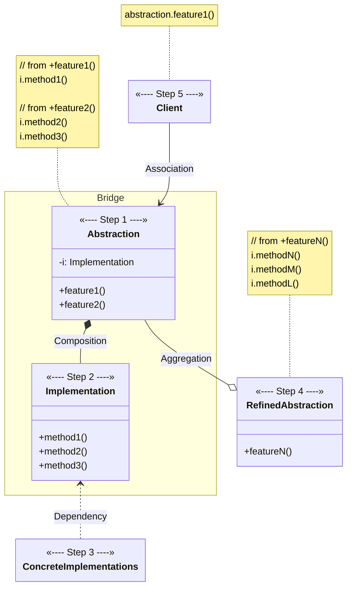
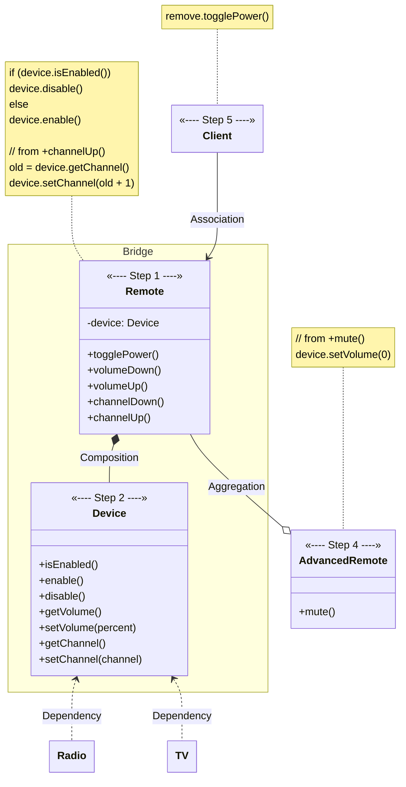

# Bridge

[_Refactoring Guru: Bridge_](https://refactoring.guru/design-patterns/bridge)

- a structural design pattern
- allows for splitting large class _(or a set of closely related classes)_ into two separate hierarchies – abstraction and implementation – which can be developed independently of each other

## The Pattern

- switches from inheritance to object composition
- extract one of dimensions into separate class hierarchy
    - means that original classes will reference object of new hierarchy instead of having all of its state and behaviors within one class

## Structure

## Pseudocode

- illustrates how `Bridge` pattern can help divide monolithic code of an app that manages devices and their remote controls

<figure>

<figcaption>The devices and remotes bridge example.</figcaption>

</figure>

- base remote control class declares reference field that links it with device object _(all remotes work with devices via general device interface)_
- can develop remote control classes independently from device classes
