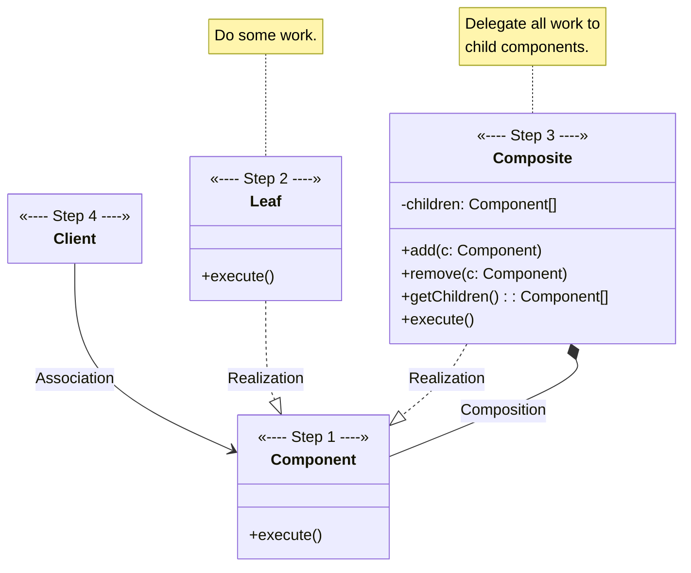
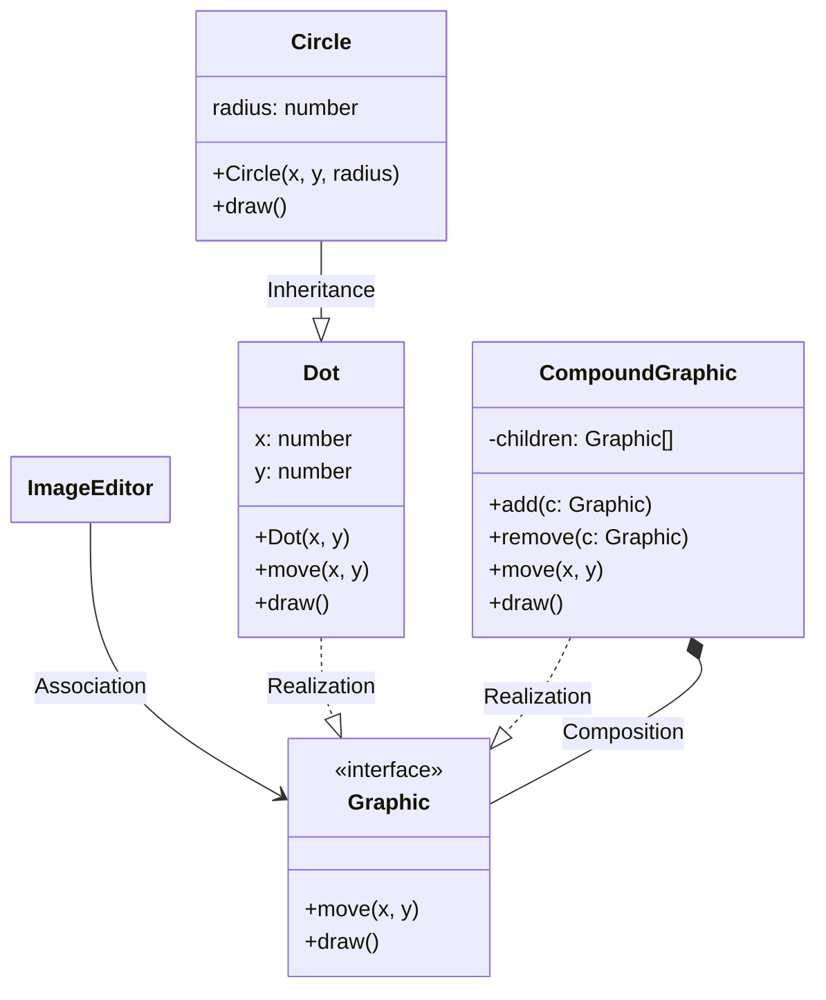

# Composite

[_Refactoring Guru: Composite_](https://refactoring.guru/design-patterns/composite)

_Also known as: **Object Tree**_

- a stuctural design pattern
- allows for composing objects into tree structures and then working with these structures as if they were individual objects

## The Pattern

> For example, imagine that you have two types of objects: `Products` and `Boxes`. A Box can contain several `Products` as well as a number of smaller `Boxes`. These little `Boxes` can also hold some `Products` or even smaller `Boxes`, and so on.
>
> Say you decide to create an ordering system that uses these classes. Orders could contain simple products without any wrapping, as well as boxes stuffed with products...and other boxes.
>
> You could try the direct approach: unwrap all the boxes, go over all the products and then calculate the total. That would be doable in the real world; but in a program, it’s not as simple as running a loop. You have to know the classes of `Products` and `Boxes` you’re going through, the nesting level of the boxes and other nasty details beforehand. All of this makes the direct approach either too awkward or even impossible.

- pattern suggests that `Products` and `Boxes` should be worked with through a common interface which declares a method for calculating the total price
- greatest benefit of approach: _don't need to care about concrete classes of objects that compose the tree since they can all be treated the same way via the common interface_

## Structure

1. **Component** interface describes operations that are common to both simple and complex elements of the tree.
2. **Leaf** is basic element of a tree and doesn't have sub-elements.
    - usually, **Leaf** components end up doing most of the real work, since they don't have anyone to delegate work to.
3. **Container** _(aka **composite**)_ is element that has sub-elements, whether it be leaves or other containers. A **Container** doesn't know concrete classes of its children and works with all sub-elements only via **Component** interface
    - upon receiving request, **Container** delegates work to its sub-elements, processes intermediate results, and then returns result to client
4. **Client** works with all elements through **Component** interface, meaning that **Client** can work in samy way with both simple and complex elements of the tree.

## Pseudocode

<figure>

<figcaption>

**Composite** pattern lets you implement stacking of geometric shapes in a graphical editor.

</figcaption>

</figure>
