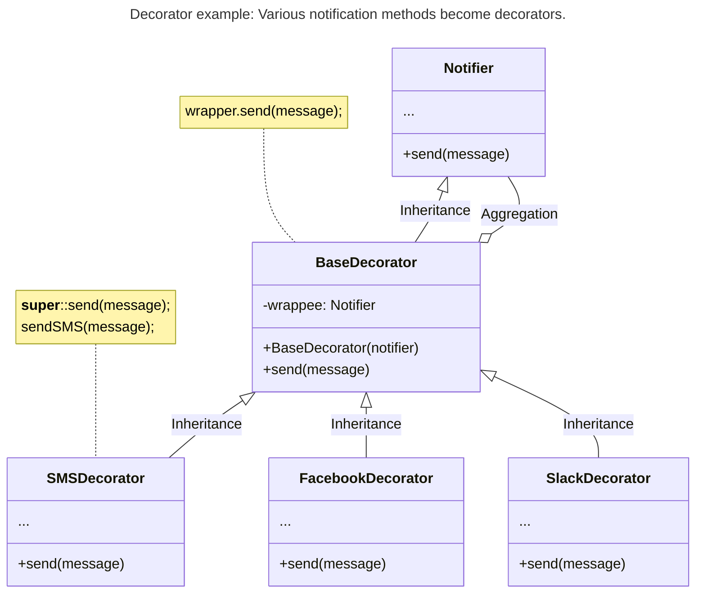
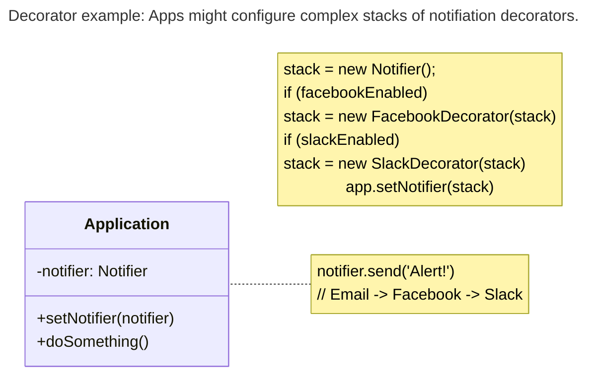
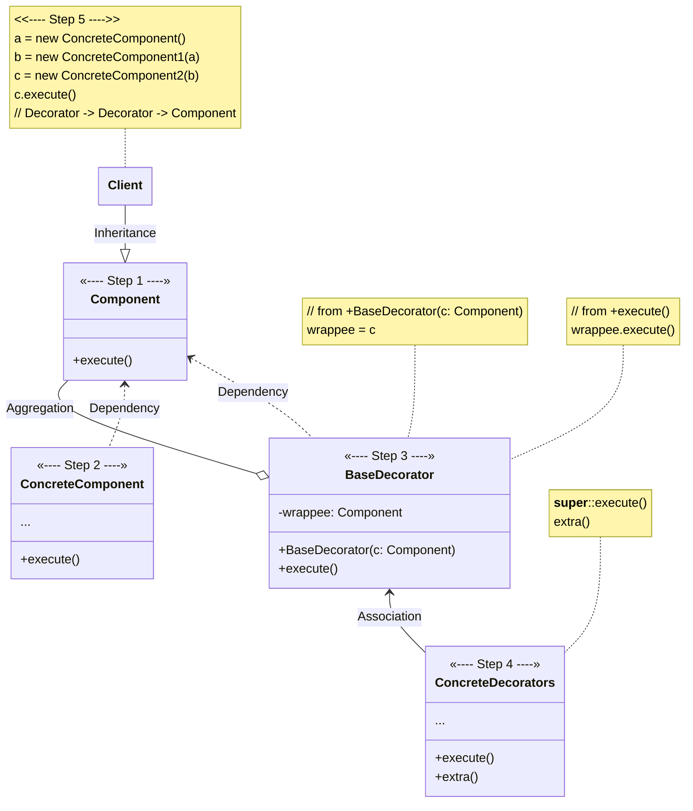
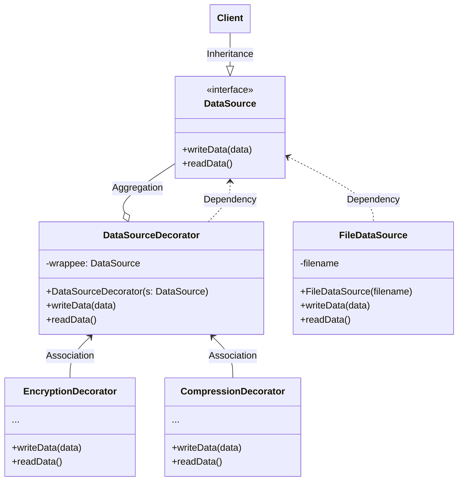

# Decorator

[_Refactoring Guru: Decorator_](https://refactoring.guru/design-patterns/decorator)

_Also known as: **Wrapper**_

- a structural design pattern
- allows for attaching new behaviors to objects by placing them inside special wrapper object that contains behaviors

## The Pattern

- object that can be linked with some _target_ object
- contains same set of methods as target and delegates to it all requests it receives
- may alter result by doing something either before or after it pass request to target

## Structure

1. **Component**: declares common interface for both wrappers and wrapped objects
2. **Concrete Component**: class of objects being wrapped
    - defines basic behavior which can be altered by decorators
3. **Base Decorator**: class has field for referencing a wrapped object
    - field's type should be declared as component interface so it can contain both concrete components and decorators
    - base decorator delegates all operations to wrapped object
4. **Concrete Decorators**: define extra behaviors that can be added to components dynamically
    - concrete decorators override methods of base decorator and execute their behavior before or after calling parent method
5. **Client**: can wrap components in multiple layers of decorators _(as long as it works with all objects via component interface)_

## Pseudocode

<figure>

<figcaption>The encryption and compression decorators example.</figcaption>

</figure>

- application wraps data source object with a pair of decorators
- both wrappers change way data is written and read from disk:
    - before data is written to disk, decorators encrypt and compress it _(original class writes encrypted, protected data to file without knowing about the change)_
    - right after data is read to disk, goes through same decorators which decompress and decode it
